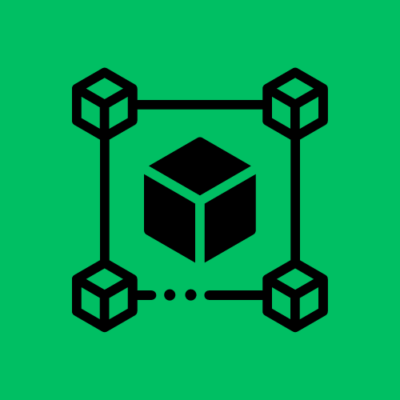

# QashChain
## quantum hash blockchain
- uses the key derivation/hash algorithm from [qash-qkdc](https://github.com/TimeMelt/qash-qkdc)
- this notebook is a demonstration of how blockchain and quantum hashing can integrate in a hybrid enviornment
- JAX is used for hardware acceleration
- tested on python v3.11

### Notes:
- this is a basic, publicly accessible implementation and may not cover all aspects of blockchain creation and deployment
    - does not handle consensus algorithm
    - does not have permission system
    - no smart contracts currently
- this blockchain can be adapted to a centralized or decentralized system

### Future Goals:
- adapt for other hardware (trapped-ion, neutral atom, etc)
- implement configurable permission system
- implement consensus algorithm (private and public modes)
- add smart contracts feature

#### Donations (optional):
- Any donation, no matter how small, is greatly appreciated!! 
- [click here to donate](https://buy.stripe.com/fZe4i46ht5mEfMkeUY)

#### Citation (this project):
- please cite this project/repo if using it in research and/or development (USE IN RESEARCH/DEVELOPMENT IS ENCOURAGED)

#### Credits:
- quantum libraries provided by PennyLane: 
    - [pennylane github](https://github.com/PennyLaneAI/pennylane)
    - [pennylane research paper](https://arxiv.org/abs/1811.04968): 
        
            Ville Bergholm et al. *PennyLane: Automatic differentiation of hybrid quantum-classical computations.* 2018. arXiv:1811.04968
- accerlation through Jax library: 
    - [jax github](https://github.com/google/jax)
    - jax citation:

            @software{
                jax2018github,
                author = {James Bradbury and Roy Frostig and Peter Hawkins and Matthew James Johnson and Chris Leary and Dougal Maclaurin and George Necula and Adam Paszke and Jake Vander{P}las and Skye Wanderman-{M}ilne and Qiao Zhang},
                title = {{JAX}: composable transformations of {P}ython+{N}um{P}y programs},
                url = {http://github.com/google/jax},
                version = {0.3.13},
                year = {2018},
            }